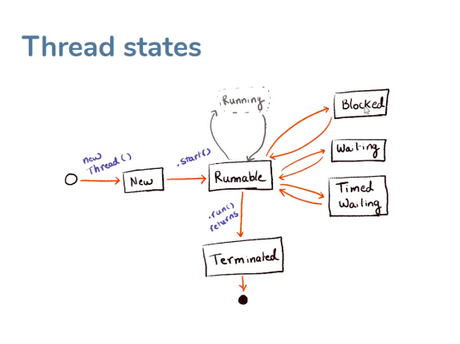

### Concurrency

#### Basic Concepts - 
- Thread : Thread is  small unit of flow that can carry out some task.
- Process : Process is any application, software or program running on Computer or server. 
    - See System Activity. There are name of all current process.
- Processor : This is also called as CPU or brain of Computer. Processors have cores which are
capable of running parallel independent task. 
    - So, the more the cores, more task task computer can handle parallely whereas, GHz is the speed with which processor can work
    - To know the number of core.  Goto Apple logo -> About this mac -> System Report.
____

#### Types of threads -
1. User Thread: The main Application thread or any other thread spawned by user to do some task 
is called User Thread.
   * When all the applications user thread dies then the main user thread die & application stops.
2. Daemon Thread: This is thread which is suppose to do some task in background. Monitoring, Logging
are the kind of work they are most fit for. 
   * So, in case of daemon thread, it dies as soon as all other user thread (except the main thread) die
   * A thread a made daemon by setting true as follow - 
     ```
        Thread a = new Thread(r);
        a.setDaemon(true);
     ```
____

#### Thread LifeCycle
* There are six states of states. [Doc](https://docs.oracle.com/javase/8/docs/api/java/lang/Thread.State.html)


* Intersting Fact:  Does the thread being in runnable state means it is running?
    Ans. No, JVM handles all thread to OS to handle it. Now OS based to availability puts the runnable state threads into running state   
____

#### Library Function for Thread
  * start()
  * join()
  * sleep()
    
  * __*Any function or method call that causes interrupt for thread to run throws InterruptedException. This need to caught in try catch*__

___

#### Docs /Links
- [Java brains Concurrency Course](https://www.javabrains.io/courses/take/java-concurrency/lessons/16805234-understanding-thread-life-cycle)
- [SDK vs JDK](https://askanydifference.com/difference-between-sdk-and-jdk/#:~:text=SDK%20stands%20for%20software%20development,a%20program%20using%20java%20language.)

____