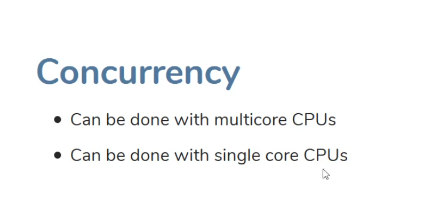

###### Parallelism vs Concurrency

Threads are executed by cores. Threads are allocatated to cores by OS Scheduler
At any given time snapshot, a core can execute just one thread
1 Defination

 
 
  
  
---
 
2 Cores requirement
  
  Parallelism needs more than one core
  
---
3 In Parallelism - In one time snapshot, 1 thread is running. 
  In Concurrency - over a period of time, all thread running depending on scheduler and making progress in their task.
  But in one time snapshot just 1 thread is running
  

 